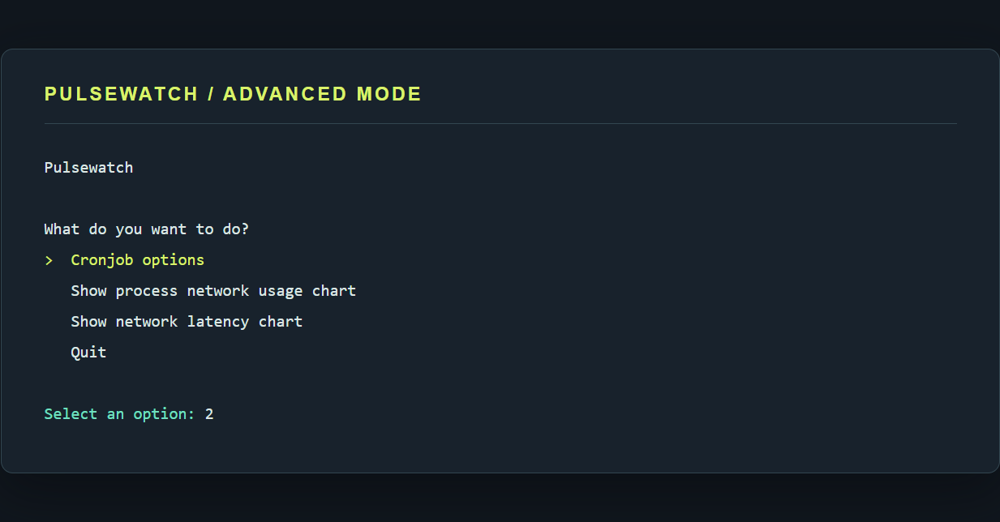
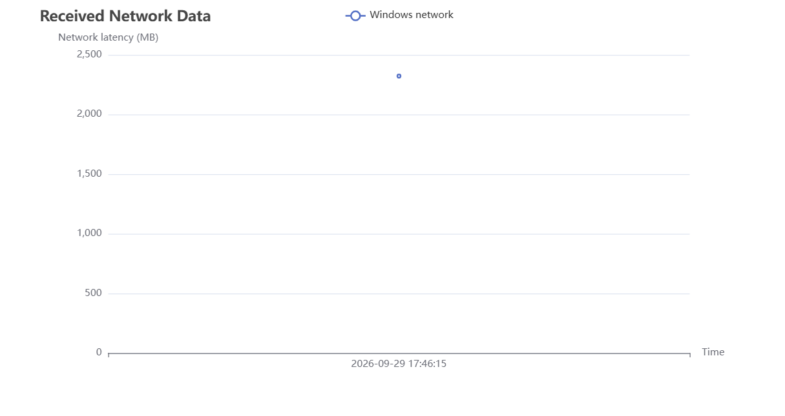
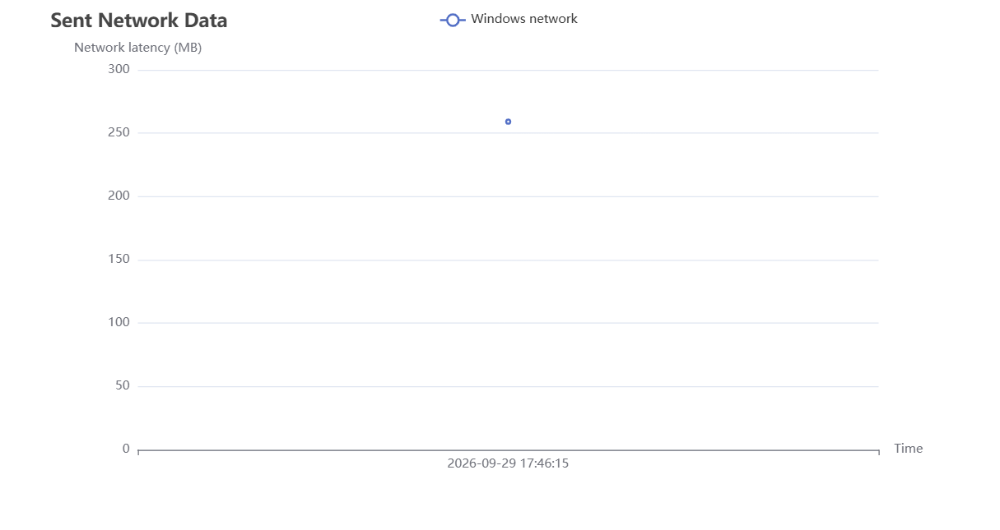
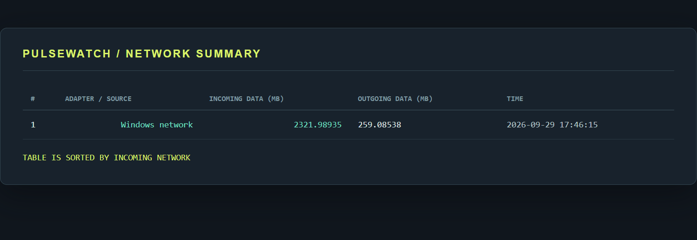
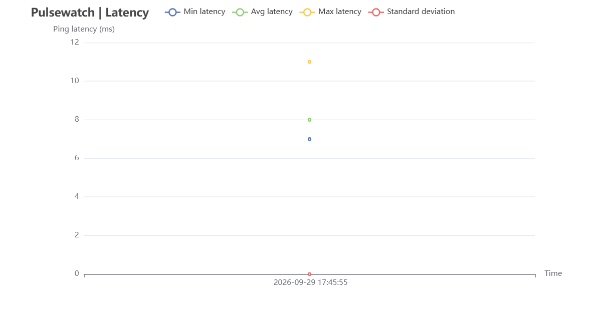
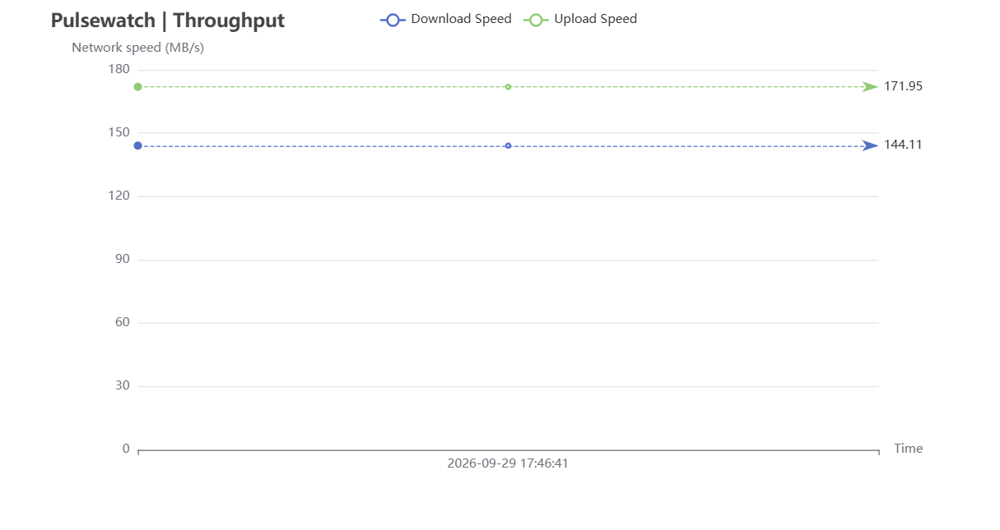

# Pulsewatch

Pulsewatch is a lightweight network observability tool for Windows and macOS. It records latency, network traffic, and connection speed, then turns those readings into charts you can inspect locally.

> This repository is a customized continuation of [Network-Latency-Visualizer](https://github.com/RichardHoa/Network-Latency-Visualizer). Review and preserve the upstream license and attribution requirements before publishing a fork.

## Features

1. **Data Visualization**: Visualize network latency data over time in easy-to-understand charts.
2. **Network Latency Monitoring**: Perform regular network latency checks using the system `ping` command. You can set the frequency of checks from every minute to once a day.
3. **Network Bandwidth Usage**: Track incoming and outgoing adapter traffic. Windows reports adapter totals; macOS can report process-level traffic through `nettop`.
4. **Download & Upload Speed**: Measure and display your current download and upload speeds.

Windows is supported through `ping.exe`, PowerShell `Get-NetAdapterStatistics`, and Windows Task Scheduler. macOS uses `ping`, `nettop`, and cron. Linux can read and render existing reports, but its live collector is not currently implemented.

## How to Use

### Windows

Install Go 1.25 or newer, open PowerShell in the project folder, and build the executable:

  ```powershell
  go build -o pulsewatch.exe .
   ```

Start data collection. Pulsewatch asks for an interval and registers a Windows Task Scheduler task named `Pulsewatch Network Scan`:

  ```powershell
  .\pulsewatch.exe
   ```

To collect one sample immediately without changing the scheduler:

  ```powershell
  .\pulsewatch.exe --collect
  ```

Open the advanced menu with:

  ```powershell
  .\pulsewatch.exe -a
  ```

To remove the scheduled collector, choose **Cronjob options > Remove cronjob completely**. You can also inspect it with:

  ```powershell
  schtasks /Query /TN "Pulsewatch Network Scan"
  ```

Windows collection uses `ping.exe` for latency and PowerShell's `Get-NetAdapterStatistics` for aggregate adapter traffic. No third-party network driver is required.

### macOS

Build and run the collector with:

  ```bash
  go build -o pulsewatch .
  ./pulsewatch
  ./pulsewatch -a
  ```

macOS collection uses `nettop` for process traffic and cron for scheduling.

### Advanced Options Menu

Upon running the advanced options, you'll see the following menu:

A terminal option screen will appear with various option, pick what you like!

```
What do you want to do?:
>  Cronjob options
   Show process network usage chart
   Show network latency chart
   Quit
```



#### Options Explained

- **Cronjob Options**: Modify or remove the existing cronjob that automates network checks. 
  ```bash
  Cronjob options:
    Edit cronjob time.
    Remove cronjob completely.
    Come back.
  ```
  The options are self-explainatory

  On Windows, inspect the scheduled task with:
  ```bash
    schtasks /Query /TN "Pulsewatch Network Scan"
  ```

    On macOS, inspect the cron entry with `crontab -l`.


- **Show process network usage chart**: These charts display the cumulative amount of data sent and received by processes since their creation. Note that the data shown is the total accumulated over time, not the current data transfer in any specific period.

  1. Received Network Data. This chart highlights the **top 3 processes** that have received the largest amount of data.
    
  2. Sent Network Data. This chart highlights the **top 3 processes** that have sent the largest amount of data.
     
  3. In addition to the charts, a detailed table with all processes and their network usage is displayed in the terminal. The processes are **ordered by the average amount of data received**.
      The table is generated live from the same Windows adapter report.
      

      Example Windows output:

      | # | Source | Incoming data (MB) | Outgoing data (MB) | Time |
      | ---: | --- | ---: | ---: | --- |
      | 1 | Windows network | 2321.98935 | 259.08538 | 2026-09-29 17:46:15 |

      On macOS, the same table contains individual process rows collected by `nettop`. On Windows, it contains adapter-level rows because Windows does not expose the same process counters through the built-in command used here.

- **Show Network Latency Chart**: No need to explain more!
  1. Network latency chart
      
  2. Speedtest chart
      
  

All HTML charts are stored in the `chart/html` folder for future access.

### Validate the project

Run the automated checks from the project folder:

```powershell
go test ./...
go vet ./...
```

### Data Storage

- **Network Bandwidth Data**: Stored in `network/network.txt`.
- **Network Latency Data**: Stored in `ping/ping.txt`.

## Why Pulsewatch

Pulsewatch is designed for quick local diagnostics: collect a small history, spot latency spikes, and compare process traffic without sending telemetry to a hosted service.

## Platform commands

- **Windows latency**: Uses `ping -n 10 google.com`.
- **Windows bandwidth**: Uses PowerShell `Get-NetAdapterStatistics` and records aggregate adapter traffic.
- **macOS latency**: Uses `ping google.com -c 10`.
- **macOS bandwidth**: Uses `nettop -l 1 -P -x` to monitor process traffic.

## Project Structure

This project is organized into several folders, each responsible for specific functionalities related to network monitoring, data tracking, and visualizations.

```bash
.
├── README.md
├── chart
│   ├── chart.go
│   └── html
│       ├── networkpid-in.html
│       ├── networkpid-out.html
│       ├── ping.html
│       └── speedtest.html
├── cronjob
│   └── cronjob.go
├── go.mod
├── go.sum
├── img
│   ├── network-latency-chart.png
│   ├── pulsewatch-menu.png
│   ├── received-network-data-chart.png
│   ├── sent-network-data-chart.png
│   ├── speedtest-chart.png
│   └── terminal-table.png
├── main.go
├── network
│   ├── network.go
│   └── network_test.go
├── ping
│   ├── ping.go
│   └── ping_test.go
├── speedtest
│   ├── speedtesting.go
│   └── speedtesting_test.go
├── table
│   └── table.go
└── terminal.go
```

## Folders Overview

### 1. `chart/`

- **Description:** Contains all the code for creating charts, which are rendered as HTML files.
- **Files:**
  - `chart.go`: Handles the creation of all charts.
  - `html/`: Subfolder where the generated HTML charts are stored.

### 2. `cronjob/`

- **Description:** Manages cron jobs for scheduling tasks. This includes the creation, deletion, and editing of cron jobs.
- **Files:**
  - `cronjob.go`: Code for setting up, deleting, and editing cron jobs.
  - `cron.txt`: Text file for setting up cronjob.

### 3. `network/`

- **Description:** Records and reads network data, preparing the necessary data for the process network usage chart.
- **Files:**
  - `network.go`: Handles the recording and reading of network usage data.
  - `network.txt`: Store all the data used for process network usage chart.

### 4. `ping/`

- **Description:** Tracks network latency by recording and reading ping data, preparing for the network latency chart.
- **Files:**
  - `ping.go`: Code responsible for managing ping data for latency charts.
  - `ping.txt`: Store all the data used for network latency chart.

### 5. `speedtest/`

- **Description:** Manages speed tests by recording and reading speed test data, which will be used in the speedtest chart. This chart appears when the process network usage chart is opened.
- **Files:**
  - `speedtest.go`: Handles speed test data tracking and preparation for the chart.
  - `speedtest.txt`: Store all the data used for speedtest chart.

### 6. `main.go`

- **Description:** The entry point of the program, responsible for initializing the entire application.

## Limitations

- **Latency Measurement**: The `ping` command measures round-trip latency; it cannot distinguish whether upload or download is slower.
- **Windows Bandwidth Detail**: Windows collection reports totals for network adapters, not individual processes.
- **macOS Process Names**: The `nettop` command can truncate long process names.

## External library being used:
- github.com/showwin/speedtest-go
- github.com/go-echarts/go-echarts/v2
- github.com/jedib0t/go-pretty

## License

This project is released under the [MIT License](LICENSE). The project also acknowledges the upstream [Network-Latency-Visualizer](https://github.com/RichardHoa/Network-Latency-Visualizer) source and its original author.

Generated binaries and reports are intentionally ignored. Before publishing changes, run `go test ./...`, `go vet ./...`, and `go build -o pulsewatch.exe .`.